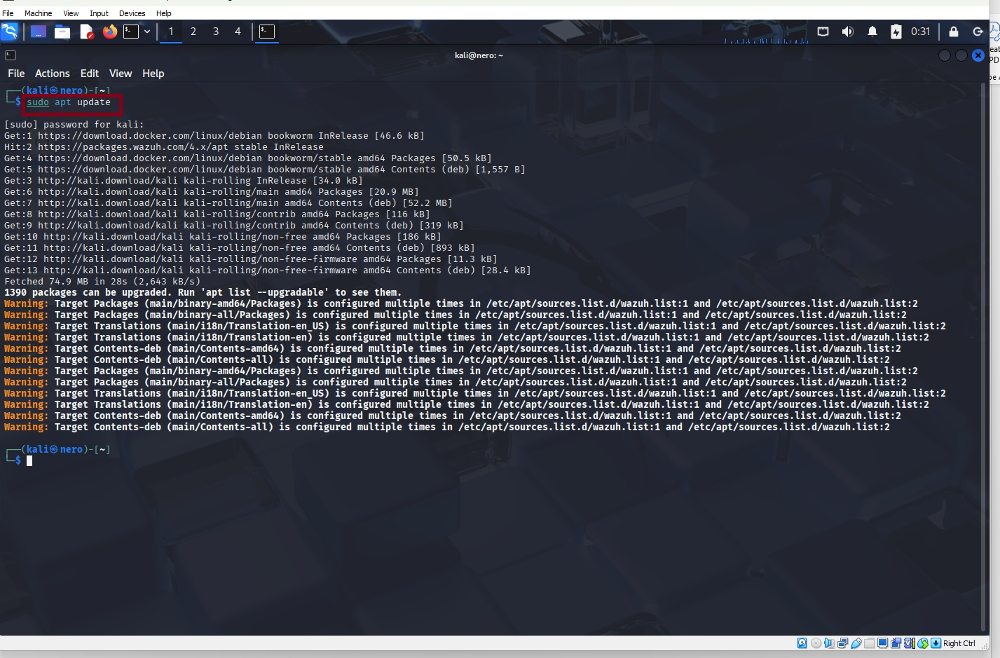

#  Apache Server Hardening & Network Threat Monitoring with Zeek

**Author:** Nyerovwo Obarueroro | **Role:** SOC Analyst | **Date:** 27/11/25

This project demonstrates a hands-on, two-phase security exercise:
1.  **Securing an Apache Web Server:** Implementing form-based authentication to protect a custom webpage.
2.  **Proactive Network Threat Hunting with Zeek:** Deploying a powerful NSM tool to monitor traffic and successfully detect a simulated attack from a predefined malicious IP address using Zeek's Intel Framework.

This lab showcases core SOC skills: defensive security hardening, proactive monitoring, log analysis, and incident detection.

---

## Table of Contents

- [Introduction](#introduction)
- [Phase 1: Apache Server Hardening](#phase-1-apache-server-hardening)
  - [Step 1: Update Kali and Install Apache](#step-1-update-kali-and-install-apache)
  - [Step 2: Start and Verify Apache Service](#step-2-start-and-verify-apache-service)
  - [Step 3: Access the Default Webpage](#step-3-access-the-default-webpage)
  - [Steps 4 & 5: Create a Custom Homepage](#steps-4--5-create-a-custom-homepage)
  - [Step 6: Restart Apache](#step-6-restart-apache)
  - [Steps 7 & 8: Implement HTTP Authentication](#steps-7--8-implement-http-authentication)
  - [Step 9: Create a Centered Login Page](#step-9-create-a-centered-login-page)
  - [Steps 10 & 11: Configure Apache for Form Auth](#steps-10--11-configure-apache-for-form-auth)
  - [Steps 12 & 13: Test Configuration and Restart](#steps-12--13-test-configuration-and-restart)
  - [Step 14: Test the Secure Login](#step-14-test-the-secure-login)
- [Phase 2: Zeek Network Monitoring & Threat Detection](#phase-2-zeek-network-monitoring--threat-detection)
  - [What is Zeek?](#what-is-zeek)
  - [Steps 15-18: Install Zeek from Source](#steps-15-18-install-zeek-from-source)
  - [Steps 19 & 20: Add Zeek to PATH and Verify](#steps-19--20-add-zeek-to-path-and-verify)
  - [Step 21: Initial Traffic Monitoring](#step-21-initial-traffic-monitoring)
  - [Steps 22 & 23: Generate and Inspect HTTP Traffic](#steps-22--23-generate-and-inspect-http-traffic)
  - [Phase 2.1: Malicious IP Detection with Intel Framework](#phase-21-malicious-ip-detection-with-intel-framework)
  - [Steps 24 & 25: Create a Malicious IP Intel File](#steps-24--25-create-a-malicious-ip-intel-file)
  - [Step 26: Create a Zeek Script to Load Intel](#step-26-create-a-zeek-script-to-load-intel)
  - [Steps 27-29: Simulate Attack and Detect Threat](#steps-27-29-simulate-attack-and-detect-threat)
- [Conclusion](#conclusion)

---

## Introduction

In modern cybersecurity, defense is multi-layered. This project emulates a real-world scenario where I:
- **Hardened a public-facing asset** (an Apache web server) by replacing its default page and adding a secure, custom login form.
- **Deployed a Network Security Monitoring (NSM) tool** (Zeek) to gain deep visibility into network traffic.
- **Leveraged threat intelligence** by feeding Zeek a list of known malicious IPs, enabling it to automatically flag and log interaction attempts.

This end to end process is critical for protecting assets and detecting intrusions in a SOC environment.

---

## Phase 1: Apache Server Hardening

### Step 1: Update Kali and Install Apache
The first step was to ensure the system was up-to-date and then install the Apache2 web server.
```bash
sudo apt update
sudo apt install apache2 -y
```



> **Caption:** *System update and Apache2 installation commands executing successfully in the terminal.*

### Step 2: Start and Verify Apache Service
After installation, the Apache service was started and its status was checked to confirm it was running without errors.
```bash
sudo systemctl start apache2
sudo systemctl status apache2
```

> **Caption:** *The `systemctl status` command confirms the Apache2 service is active (running), indicating a successful start.*

### Step 3: Access the Default Webpage
To verify the server was operational, I accessed Apache's default landing page via the browser using my machine's IP address: `http://192.168.0.31`.

> **Caption:** *The default "Apache2 Debian Default Page" loads successfully in the browser, confirming the web server is publicly accessible.*

### Steps 4 & 5: Create a Custom Homepage
The default page was removed and replaced with a custom HTML page to present a unique, professional front.
```bash
cd /var/www/html
sudo rm index.html
sudo nano index.html
```


> **Caption:** *Navigating to the web directory and creating a new `index.html` file to host our custom content.*


> **Caption:** *Editing the new `index.html` file with a simple yet custom welcome message, ready to be protected.*

### Step 6: Restart Apache
The Apache service was restarted to apply the changes and serve the new custom homepage.
```bash
sudo systemctl restart apache2
```

> **Caption:** *Restarting the Apache service to ensure all new configurations and files are loaded correctly.*

### Steps 7 & 8: Implement HTTP Authentication
To secure the page, I installed `apache2-utils` and created a password file with four user accounts.
```bash
sudo apt install apache2-utils -y
sudo htpasswd -c /etc/apache2/.htpasswd_users Chris
# ... (Added Felix, Sophie, etc.)
```


> **Caption:** *Creating a password file (`/etc/apache2/.htpasswd_users`) to store user credentials for HTTP authentication.*

### Step 9: Create a Centered Login Page
A custom, professionally styled login page was created to provide a clean user experience for authentication.
```bash
sudo nano /var/www/html/login.html
```


> **Caption:** *The custom, centered login page as rendered in the browser. This provides a much cleaner interface than the default browser login prompt.*

### Steps 10 & 11: Configure Apache for Form Auth
The necessary Apache modules were enabled, and the site's configuration was edited to implement form-based authentication, linking the login page and password file.
```bash
sudo a2enmod session session_cookie auth_form authn_file request rewrite
sudo nano /etc/apache2/sites-enabled/000-default.conf
```


> **Caption:** *The critical Apache configuration that ties the login page, password file, and protected directory together, enabling form-based authentication.*

### Steps 12 & 13: Test Configuration and Restart
Before applying the new config, it's crucial to test for syntax errors to avoid breaking the service. After a successful test, Apache was restarted.
```bash
sudo apachectl configtest
sudo systemctl restart apache2
```


> **Caption:** *The `Syntax OK` message from `apachectl configtest` gives the green light to safely restart the service with the new security configuration.*

### Step 14: Test the Secure Login
The final test: accessing the site now redirects to the custom login page, and only authorized credentials grant access to the custom homepage.

> **Caption:** *Success! After entering valid credentials, the user is granted access to the previously created custom homepage, demonstrating the fully functional authentication wall.*

---

## Phase 2: Zeek Network Monitoring & Threat Detection

### What is Zeek?
Zeek is an open-source Network Security Monitoring (NSM) tool. Unlike traditional IDS that relies on signatures, Zeek interprets network traffic and generates rich, structured logs of the activity it sees. This allows SOC analysts to hunt for threats based on behavior and patterns, making it invaluable for detecting both known and unknown attacks.

### Steps 15-18: Install Zeek from Source
To get the latest features, Zeek was compiled from source. This involved installing all dependencies, cloning the repository, configuring the build, and compiling the software.
```bash
sudo apt update && sudo apt install -y cmake make gcc g++ flex bison libpcap-dev libssl-dev python3 python3-dev swig git
git clone --recursive https://github.com/zeek/zeek.git
cd zeek
./configure
make -j$(nproc)
sudo make install
```


> **Caption:** *The process of building Zeek from source. The `./configure` output shows a successful configuration, and the `make` process compiles the code (this can take 30-60 minutes).*

### Steps 19 & 20: Add Zeek to PATH and Verify
Zeek's binary directory was added to the system's `PATH` for easy access, and the installation was verified by checking the version.
```bash
echo 'export PATH=/usr/local/zeek/bin:$PATH' >> ~/.bashrc
source ~/.bashrc
zeek --version
```


> **Caption:** *Confirming a successful Zeek installation by displaying the version information. The system now recognizes the `zeek` command.*

### Step 21: Initial Traffic Monitoring
A dedicated directory was created for Zeek logs, and Zeek was started to monitor traffic on the `eth0` interface.
```bash
mkdir -p ~/zeek-logs
cd ~/zeek-logs
sudo /usr/local/zeek/bin/zeek -i eth0 local
```

> **Caption:** *Running Zeek in monitor mode on interface `eth0`. Zeek begins capturing traffic and will generate several log files in the directory.*

### Steps 22 & 23: Generate and Inspect HTTP Traffic
Traffic was generated by curling the Apache server, and Zeek's `http.log` was inspected to confirm it was capturing the session details.
```bash
curl http://192.168.0.31
cat http.log
```


> **Caption:** *The contents of `http.log` show a detailed record of the HTTP request made by `curl`, including timestamps, URIs, status codes, and user agents. This demonstrates Zeek's powerful logging capabilities.*

---

## Phase 2.1: Malicious IP Detection with Intel Framework

### Steps 24 & 25: Create a Malicious IP Intel File
The core of proactive detection: an Intel file was created, listing a known malicious IP address (`192.168.0.37`) and its associated metadata.
```bash
cd ~/zeek-logs
nano malicious-ip.intel
```


> **Caption:** *The `malicious-ip.intel` file. The structure uses tabs to separate fields, defining the indicator (IP), its type, and a description for context.*

### Step 26: Create a Zeek Script to Load Intel
A simple Zeek script was written to load the Intel framework and process the data from our custom Intel file.
```bash
nano load_intel.zeek
```
*Content of `load_intel.zeek`:*
```zeek
@load policy/frameworks/intel/seen
@load policy/frameworks/intel/do_notice
redef Intel::read_files += { "../malicious-ip.intel" };
```


> **Caption:** *The Zeek script that activates the Intel Framework and instructs Zeek to read our `malicious-ip.intel` file upon execution.*

### Steps 27-29: Simulate Attack and Detect Threat
Zeek was run with the Intel script active. From the "malicious" machine, a `curl` request was sent to the Apache server. Zeek immediately detected the connection from the blacklisted IP and logged the event in `intel.log`.
```bash
# On Zeek Machine:
sudo /usr/local/zeek/bin/zeek -C -i eth0 local ./load_intel.zeek

# On Attacker Machine:
curl http://192.168.0.31

# Back on Zeek Machine - Stop Zeek (Ctrl+C) then:
cat intel.log
```


> **Caption:** *The moment of truth! The `intel.log` file shows a successful detection. Zeek has flagged the connection from our simulated attacker IP (`192.168.0.30`), noting it as a known malicious indicator. This is exactly how a SOC would detect a real-world intrusion attempt from a known bad actor.*

---

## Conclusion

This project successfully simulated a robust defensive security posture:

- **Server Hardening:** The Apache server was secured with a custom authentication mechanism, moving beyond the default setup.
- **Network Visibility:** Zeek was deployed, providing deep, actionable logs of all network traffic.
-  Proactive Threat Detection: By leveraging Zeek's Intel Framework, the system automatically detected and alerted on a connection from a known malicious IP.

This end-to-end process is a fundamental demonstration of core SOC analyst responsibilities: building secure systems, monitoring for anomalies, and using threat intelligence to proactively identify and respond to threats. The skills practiced here—system administration, log analysis, and tool configuration—are directly transferable to a professional security operations center.

---
*This lab was conducted in a controlled environment. All IP addresses are from private lab networks.*

***
